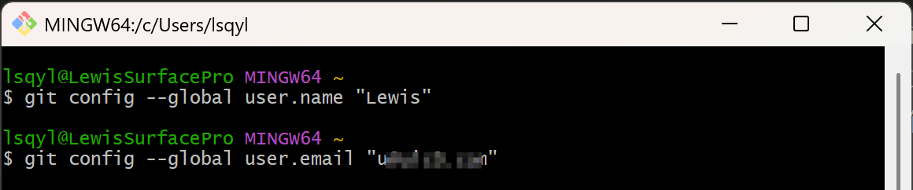
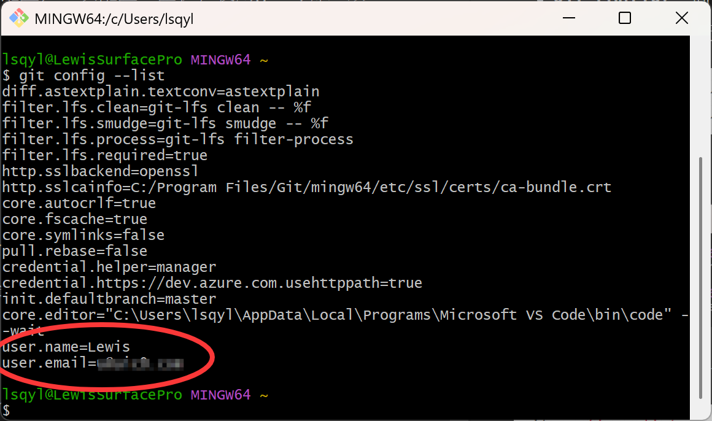
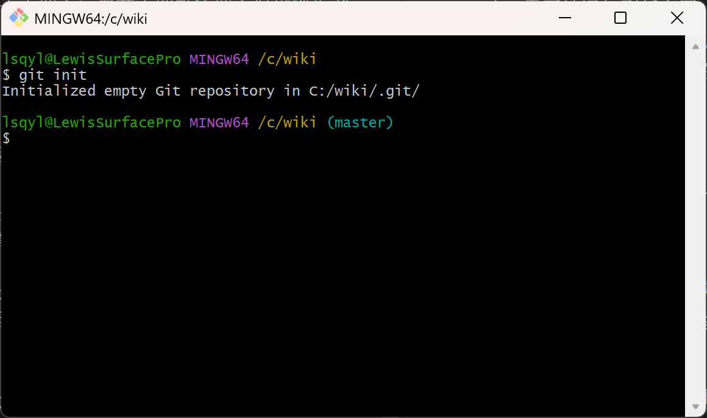

# Git 图文教程

## Git 介绍

Git 的三个区域：

* **工作区**： 处理工作的区域
* **暂存区**： 临时存放的区域
* **本地git仓库**： 最终的存放区域

在文件夹的体现如下：

* **工作区**： 在你电脑里看到的目录
* **暂存区**： 在.git文件夹内的index中 (二进制记录)
* **版本库**： 指的整个.git文件夹 (也认为是本地仓库)

### Git配置

安装完 Git 之后，要做的第一件事就是设置你的用户名和邮件地址。因为每一个 Git 提交都会使用这些信息

命令格式如下：中文自己看情况换

* **git config**： 固定命令，设置git相关配置
* **–global**： 全局配置；一次配置，整机在使用git时都生效

```
git config --global user.name "你的用户名"
git config --global user.email "你的邮箱地址"
```

运行命令效果如下图：



配置后，可以运行如下命令查看是否成功

```
git config --list  
#如果信息太多，可以输入 q 退出
```

运行命令效果如下图：



出现以上内容即为注册成功。如果后续想要修改，只需要重新执行一下命令即可

### 文件右侧标记

右侧没有标记的时候为未修改 或 此文件/文件夹，被git忽略不跟踪变化

* **M：已修改（Modified）** - 文件已被修改但还没有被添加到暂存区
* **A：已添加（Added）** - 文件已经被添加到暂存区，但还没有被提交
* **D：已删除（Deleted）** - 文件已经被删除，并且已经被标记为删除，但还没有提交
* **R：已重命名（Renamed）** - 文件已经被重命名，这也算作是一种修改，需要被添加到暂存区
* **C：已复制（Copied）** - 文件已经被复制，这也算作是一种修改，需要被添加到暂存区
* **U：已更新但未融合（Updated but Unmerged）** - 这表示一个文件已经被更新了，但在合并时发生了冲突，需要手动解决冲突后再标记为已解决

## Git基础命令

### 初始化空的Git仓库

新建一个文件夹或现有的文件夹并不是 git 仓库，因为文件夹内不包含 `.git` 文件夹，没有被 git 管理

可以在新文件夹或现有文件夹，运行如下命令得到 `.git` 文件夹，初始化成功则可让 git 开始准备管理

```
# 初始化 git 仓库, 产物: .git 文件夹 (所在文件夹"内"被管理)  
git init
```



初始化空的 git 仓库成功后，在项目文件夹中，开启显示隐藏文件，即可查看 `.git` 文件夹

* 对于 `Windows` 系统，在查看里面勾选隐藏的项目选项
* 对于 `macOS` 系统，使用快捷键`Command + Shift + .`切换隐藏文件显示

### 记录更新到Git仓库

每当完成了一个阶段的目标，想要记录下它时，就将它提交到仓库

核心操作：`工作区开发`—>`将修改后的文件添加到暂存区`—>`将暂存区的文件记录到版本库`

把工作区变化放到暂存区中，执行如下命令

```
# 将 index.html 添加到暂存区  
git add index.html  
  
# 将css目录下一切添加到暂存区  
git add css
```

如下命令，可以一次性把所有变化文件放入暂存区

```
# .的意思是当前目录下所有变化都暂存  
git add .
```

把暂存区内容，提交到版本库，命令如下（此处文字说明可以不加引号）

```
git commit -m '提交的内容说明'
```

以上命令相当于存档了一次，在版本库中产生一次提交记录并生成版本号

本次存档，不耽误我们在工作区 (项目文件夹) 下继续编写项目

### Git日志及状态查看

查看所有提交的日志记录，命令如下

```
git log  
```


