## git的下载

* [git-scm](https://https://git-scm.com/)
* [git for windows](https://gitforwindows.org/)
* [阿里镜像](https://registry.npmmirror.com/binary.html?path=git-for-windows/)


<Callout title="git-scm是git的官方地址">
git for windows里只有windows系统的安装包
阿里镜像直接Ctrl+F 搜索最新版本前缀即可，如2.48.1
</Callout>

## git的安装

### 使用许可声明

双击下载后的安装文件，开始安装，这个界面主要展示了GPL第2版协议1的内容

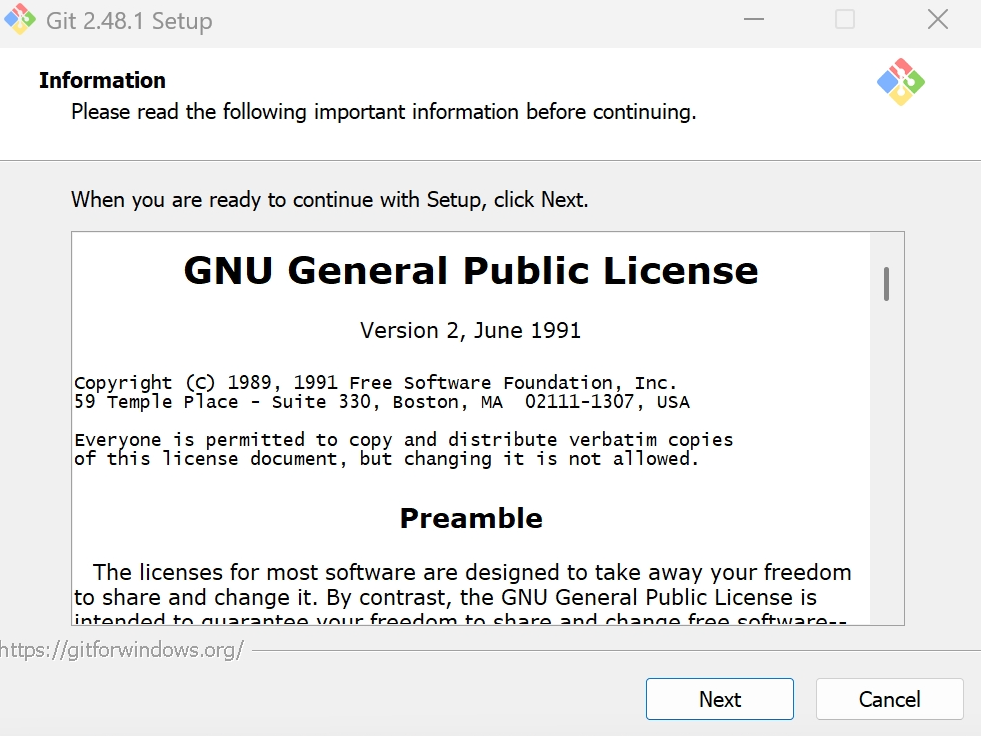

### 选择安装目录

可点击 `Browse…` 更换目录，也可直接在方框里面改。

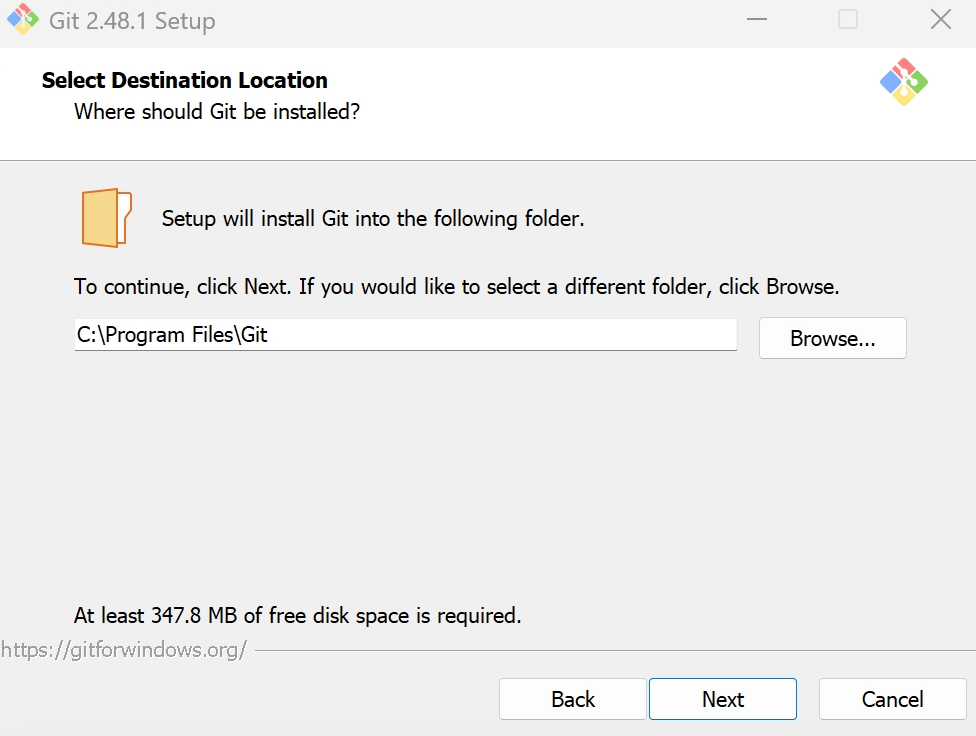

### 选择安装组件

一般吧第一项创建桌面快捷方式选中，其余按默认即可

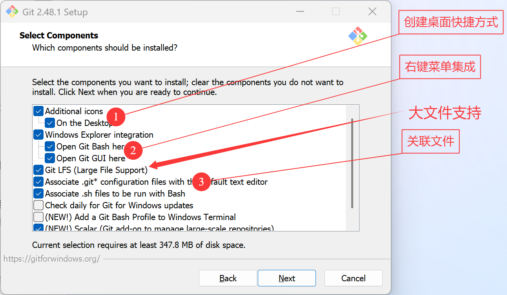

### 选择开始菜单文件夹

方框内 Git 可改为其他名字，也可点击 `Browse...` 选择其他文件夹或者给 `Don't create a Start Menu folder` 打勾不要文件夹

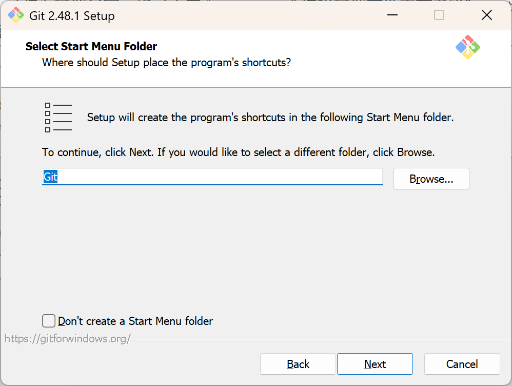

### 选择编辑器

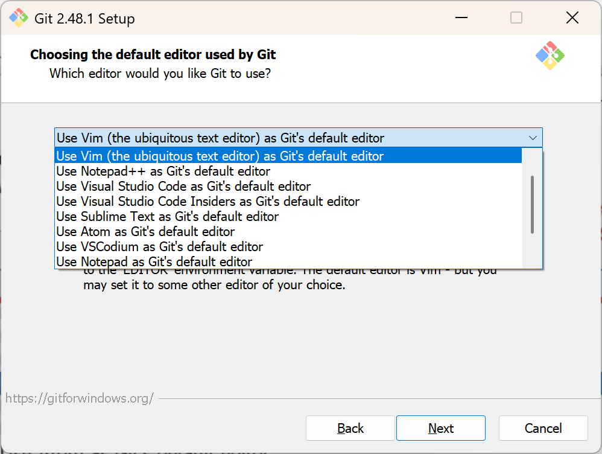

<Callout title="warning 注意"> 

默认为VIM编辑器，我电脑上安装了`vscode`，就选择了`vscode`

</Callout>

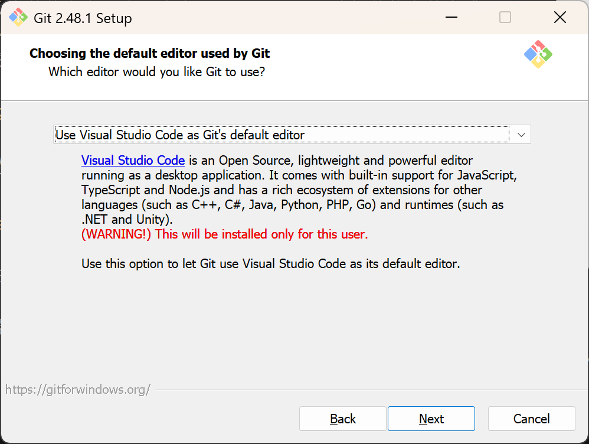

### 决定初始化新项目(仓库)的主干名字

第一种是让 Git 自己选择，名字是 master ，但是未来也有可能会改为其他名字；第二种是我们自行决定，默认是 main，当然，你也可以改为其他的名字。一般默认第一种

::: details

很多团队已经重命名他们的默认主干名为 main . 这是因为2020 年非裔男子乔治·弗洛伊德因白人警察暴力执法惨死而掀起的 Black Lives Matter(黑人的命也是命)运动，很多人认为 master 不尊重黑人，呼吁改为 main.

:::

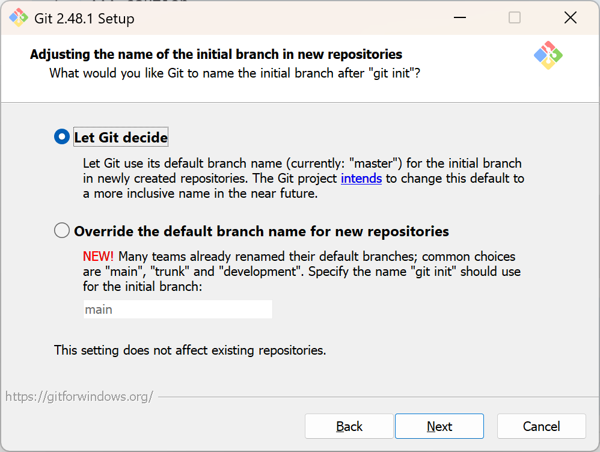

### 调整你的 path 环境变量

下方是各选项的翻译，一般情况默认即可

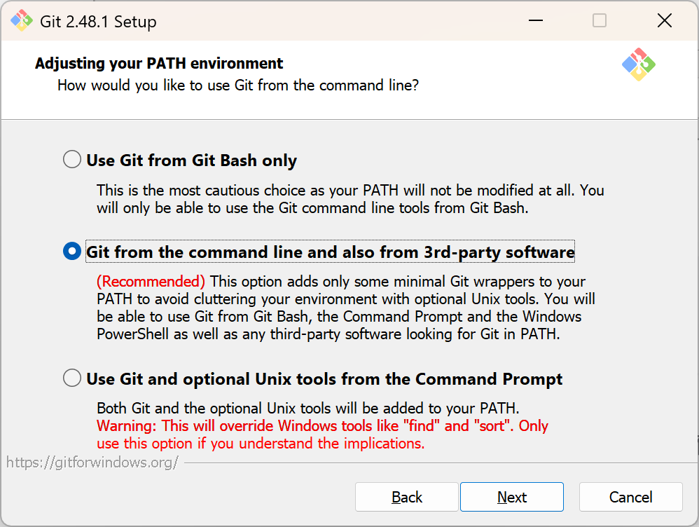

::: details Use Git from Git Bash only

`This is the most cautious choice as your PATH will not be modified at all. You w only be able to use the Git command line tools from Git Bash.`
仅从 Git Bash 使用 Git .这是最谨慎的选择，因为您的 PATH 根本不会被修改。您将只能使用 Git Bash 中的 Git 命令行工具。

:::

::: details Git from the command line and also from 3rd-party software

`(Recommended) This option adds only some minimal Git wrappers to your PATH to avoid cluttering your environment with optional Unix tools.You will be able to use Git from Git Bash, the Command Prompt and the Windov PowerShell as well as any third-party.software looking for Git in PATH.`
（推荐）此选项仅将一些最小的 Git 包装器添加到PATH中，以避免使用可选的 Unix 工具使环境混乱。您将能够使用 Git Bash 中的 Git，命令提示符和 Windov PowerShell 以及在 PATH 中寻找 Git 的任何第三方软件。

:::

::: details Use Git and optional Unix tools from the Command Prompt

`Both Git and the optional Unix tools will be added to your PATH. Warning: This will override Windows tools like "find"and "sort". Only use this option if you understand the implications.`
使用命令提示符中的 Git 和可选的 Unix 工具 Git 和可选的 Unix 工具都将添加到您的 PATH 中。
警告：这将覆盖 Windows 工具，例如 "find" and "sort". 仅在了解其含义后使用此选项。

:::

### 选择 SSH 执行文件

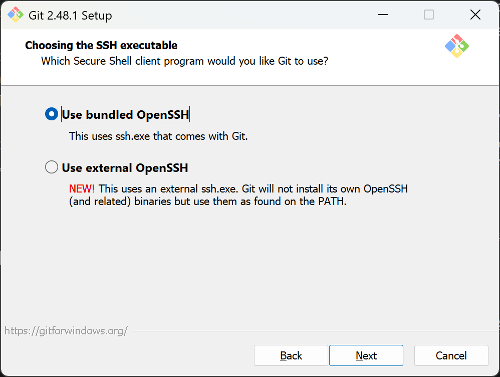

一般默认即可

翻译如下：

::: details Use bundled OpenSSH

This uses ssh. exe that comes with Git.
使用捆绑的 OpenSSH
这使用的 ssh.exe 是 Git 自带的

:::

::: details Use external OpenSSH

NEW! This uses an external ssh. exe. Git will not install its own OpenSSH

(and related) binaries but use them as found on the PATH.

使用外部 OpenSSH

新！这使用外部 ssh.exe 文件。

Git 不会安装自己的 OpenSSH（和相关）二进制文件，而是使用在环境变量 PATH 中找到的它们。

:::

### 选择HTTPS后端传输

一般情况下默认即可

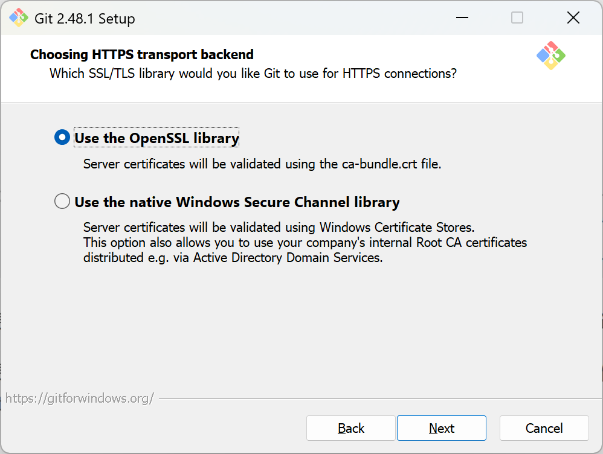

翻译如下：

```
use the OpenSSL library 
Server certificates will be validated using the ca-bundle. crt file.

使用 OpenSSL 库
服务器证书将使用 ca-bundle.crt 文件进行验证。
	
Use the native Windows Secure Channel library 
Server certificates will be validated using Windows Certificate Stores.
This option also allows you to use your company's internal Root CA certificates distributed e.g. via Active Directory Domain Services.

使用本机 Windows 安全通道库
服务器证书将使用 Windows 证书存储进行验证。
此选项还允许您使用公司内部分发的内部根 CA 证书，例如通过 Active Directory 域服务。
```

这两种选项有什么区别呢？

来自https://stackoverflow.com/questions/62456484/whats-the-difference-between-openssl-and-the-native-windows-secure-channel-libr

> 如果在具有企业管理证书的组织中使用 Git，则将需要使用安全通道。如果你仅使用 Git 来访问公共存储库（例如 GitHub ），或者你的组织不管理自己的证书，那么使用 SSL 后端（它们只是同一协议的不同实现）就可以了。

也就是说，作为普通用户，只是用 Git 来访问 Github、GitLab 等网站，选择前者就行了。

### 配置行尾符号转换

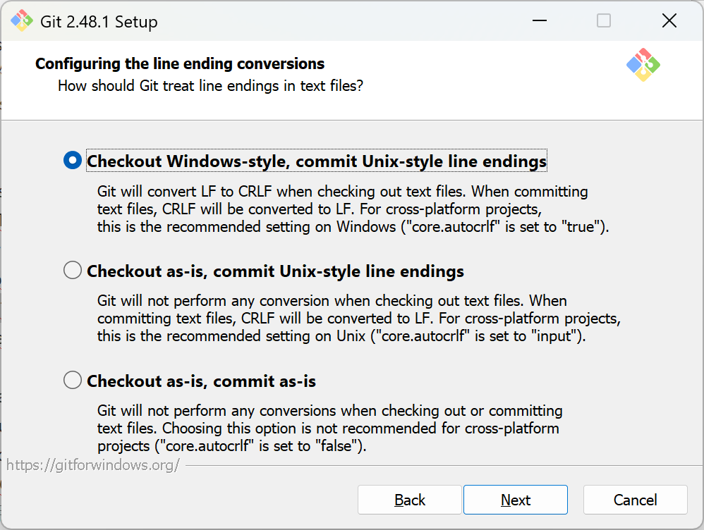

翻译如下：

```
Checkout Windows-style, commit Unix-style line endings 
Git will convert LF to CRLF when checking out text files. 
When committing text files, CRLF will be converted to LF. For cross-platform projects, this is the recommended setting on Windows("core. autocrif"is set to "true").
签出 Windows 样式，提交 Unix 样式的行结尾
Git 签出文本文件时，会将 LF 转换为 CRLF。
提交文本文件时，CRLF 将转换为 LF。
对于跨平台项目，这是 Windows 上的建议设置（"core.autocrif" 设置为 "true"）。

Checkout as-is, commit Unix-style line endings 
Git will not perform any conversion when checking out text files. 
When committing text files, CRLF will be converted to LF. For cross-platform projects, this is the recommended setting on Unix("core.autocrif" is set to "input").
按原样签出，提交 Unix 样式的行结尾
Git 在签出文本文件时不会执行任何转换。提交文本文件时，CRLF 将转换为 LF。
对于跨平台项目，这是在 Unix 上的建议设置（"core.autocrif" 设置为 "input"）。

Checkout as-is, commit as-is 
Git will not perform any conversions when checking out or committing text files. 
Choosing this option is not recommended for cross-platform projects("core. autocrif"is set to "false").
按原样签出，按原样提交
Git 在签出或提交文本文件时不会执行任何转换。
不建议跨平台项目选择此选项（"core.autocrif" 设置为 "false"）。
```

这三种选择分别是：
`签出 Windows 样式，提交 Unix 样式的行结尾。`
`按原样签出，提交Unix样式的行结尾。`
`按原样签出，按原样提交。`

那 Windows 样式和 Unix 样式到底有什么区别呢？

引用 《[GitHub入门与实践](https://book.douban.com/subject/26462816/)》 第 50 页内容

> GitHub 中公开的代码大部分都是以 Mac 或 Linux 中的 LF（Line Feed）换行。然而，由于 Windows 中是以 CRLF（Carriage Return+ Line Feed）换行的，所以在非对应的编辑器中将不能正常显示。
> Git 可以通过设置自动转换这些换行符。使用 Windows 环境的各位，请选择推荐的 “Checkout Windows-style，commit Unix-style line endings” 选项。换行符在签出时会自动转换为 CRLF，在提交时则会自动转换为 LF .

上面说 Mac 、Linux、Unix 的 Line Feed ，翻译过来就是换行符，用 “\n” 表示，换行符 “\n” 的 ASCII 值为10；
Windows 的是 Carriage Return+ Line Feed（回车+换行），用 “\r\n” 表示，回车符 “\r” 的 ASCII 值为13；

这上下两者是不一样的。
所以这就需要转换了，至于为什么选第一项？
这还用问吗？`我们现在的教程就是介绍怎么安装 Windows 版 Git，肯定选第一项啦。`

### 配置终端模拟器以与 Git Bash 一起使用

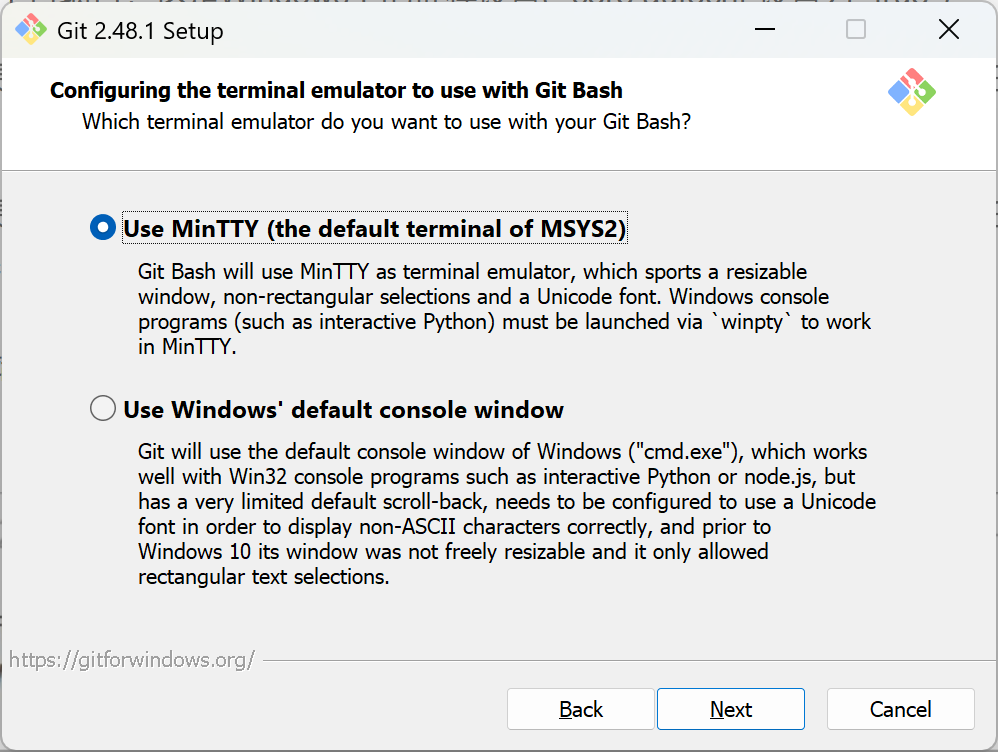

```
Use MinTTY(the default terminal of MSYS2)
Git Bash will use MinTTY as terminal emulator, which sports a resizable window
non-rectangular selections and a Unicode font.Windows console programs(such
as interactive Python) must be launched via 'winpty' to work in MinTTY.
使用 MinTTY（MSYS2的默认终端）
Git Bash 将使用 MinTTY 作为终端仿真器，该仿真器具有可调整大小的窗口非矩形选择和 Unicode 字体。
Windows 控制台程序（例如交互式 Python）必须通过 "winpty" 启动才能在 MinTTY 中运行。

Use Windows' default console
window Git will use the default console window of Windows("cmd.exe"), which works v
with Win32 console programs such as interactive Python or node. js, but has a
very limited default scroll-back,needs to be configured to use a Unicode font in
order to display non-ASCII characters correctly, and prior to Windows 10 its
window was not freely resizable and it only allowed rectangular text selections.
使用 Windows 的默认控制台窗口
Git 将使用 Windows 的默认控制台窗口（"cmd.exe"），该窗口可与 Win32 控制台程序（例如交互式Python 或
node.js）一起使用，但默认回滚非常有限，需要将其配置为使用 Unicode 字体才能正确显示非 ASCII 字符，并且在
Windows 10 之前，其窗口不可随意调整大小，并且仅允许选择矩形文本。
```

`建议选择第一种`，MinTTY功能比 cmd 多，cmd 只不过 比 MinTTY 更适合处理 Windows 的一些接口问题，这个对 Git 用处不大，除此之外 Windows 的默认控制台窗口（cmd）有很多劣势，比如 cmd 具有非常有限的默认历史记录回滚堆栈和糟糕的字体编码等等。
相比之下，MinTTY 具有可调整大小的窗口和其他有用的可配置选项，可以通过右键单击的工具栏来打开它们

### 选择默认的 “git pull” 行为

```
ODefault(fast-forward or merge)
This is the standard behavior ofgit pull": fast-forward the current branch to
the fetched branch when possible, otherwise create a merge commit.
默认（快进或合并）
这是 "git pull" 的标准行为：在可能的情况下将 当前分支 快进到 获取的分支，否则创建合并提交。

ORebase Rebase the current branch onto the fetched branch. If there are no local
commits to rebase, this is equivalent to a fast-forward.
变基将当前分支变基到获取的分支上。如果没有本地提交要变基，则等同于快进。

Oonly ever fast-forward
Fast-forward to the fetched branch. Fail if that is not possible.
只能快进快进到获取的分支。如果不可能，则失败。
```

git pull” 是什么意思呢？
git pull 就是获取最新的远程仓库分支到本地，并与本地分支合并

上面给了三个 “git pull” 的行为：
第一个是 `merge`
第二个是 `rebase`
第三个是 `直接获取`

第一种 `git pull = git fetch + git merge`
第二种 `git pull = git fetch + git rebase`
第三种 `git pull = git fetch` ？(这个没试过，纯属猜测

一般默认选择第一项，`git rebase` 绝大部分程序员都用不好或者不懂，而且风险很大，但是很多会用的人也很推崇，但是用不好就是灾难。

git pull 只是拉取远程分支并与本地分支合并，而 git fetch 只是拉取远程分支，怎么合并，选择 merge 还是 rebase ，可以再做选择。

### 选择一个凭证帮助程序

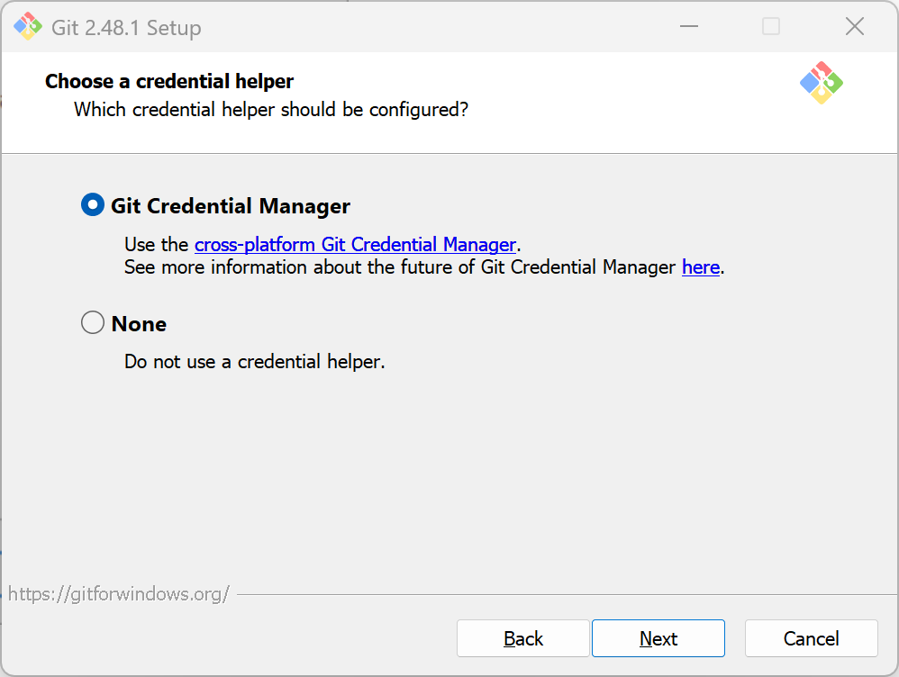

一般默认选项即可

翻译如下：

```
Git Credential Manager 
Use the cross-platform Git Credential Manager.
See more information about the future of Git Credential Manager here.
Git 凭证管理
使用跨平台的 Git  凭证管理。
在此处查看有关 Git 凭证管理未来的更多信息。

None 
Do not use a credential helper.
不使用凭证助手。
```

一共两个选项：
`Git 凭证管理`
`不使用凭证助手`

第一个选项是提供`登录凭证`帮助的，Git 有时需要用户的凭据才能执行操作；例如，可能需要输入`用户名`和`密码`才能通过 HTTP 访问远程存储库（GitHub，GItLab 等等）。

### 配置额外的选项

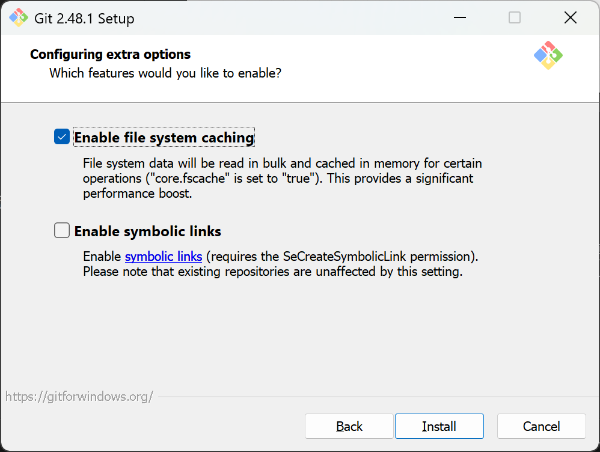

一般情况下默认即可

翻译如下：

```
Enable file system caching
File system data will be read in bulk and cached in memory for certain operations("core.fscache" is set to "true").
This provides a significant performance boost.
启用文件系统缓存
将批量读取文件系统数据并将其缓存在内存中以进行某些操作（"core.fscache” 设置为 "true"）。
这可以显着提高性能。

Enable symbolic links
Enable symbolic links(requires the SeCreateSymbolicLink permission).
Please note that existing repositories are unaffected by this setting.
启用符号链接
启用符号链接（需要SeCreateSymbolicLink权限）。
请注意，现有存储库不受此设置的影响。
```

有两个选项：
`启用文件系统缓存`
`启用符号链接`

`启用文件系统缓存`:就是将批量读取文件系统数据并将其缓存在内存中以进行某些操作，可以显著提升性能。这个选项默认开启。
`启用符号链接` :符号链接是一类特殊的文件， 其包含有一条以绝对路径或者相对路径的形式指向其它文件或者目录的引用，类似于 Windows 的快捷方式，不完全等同 类Unix（如 Linux） 下的 符号链接。因为该功能的支持需要一些条件，所以默认不开启。

### 安装成功

点击install即可进入安装界面，随后等待一会安装成功。

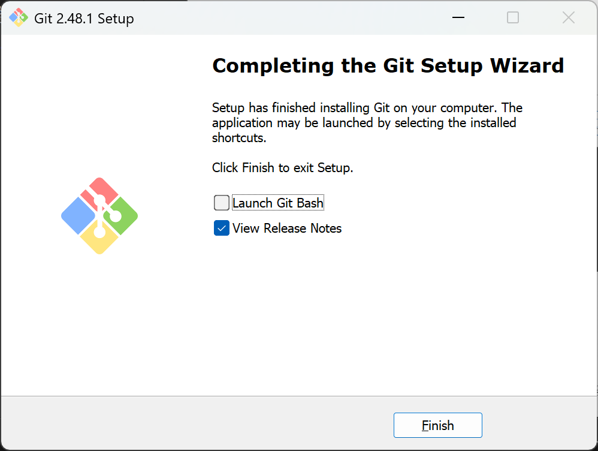

关闭`View Release Notes` 选项，然后点击`Finish`即可安装成功。

## Git的功能介绍

安装成功之后会有以下软件

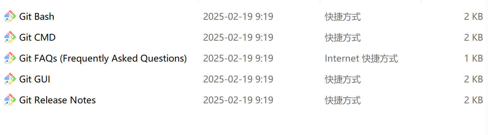

有 `Git Bash`、`Git CMD`、`Git FAQs`、`Git GUI`、`Git Release Note`，下面我们就分别介绍一下这几个。

### Git Bash

`Git Bash` 是基于CMD命令行的，在CMD的基础上增添一些新的命令与功能，平时主要用这个，功能丰富，高效（需要掌握一些基础的Linux命令）

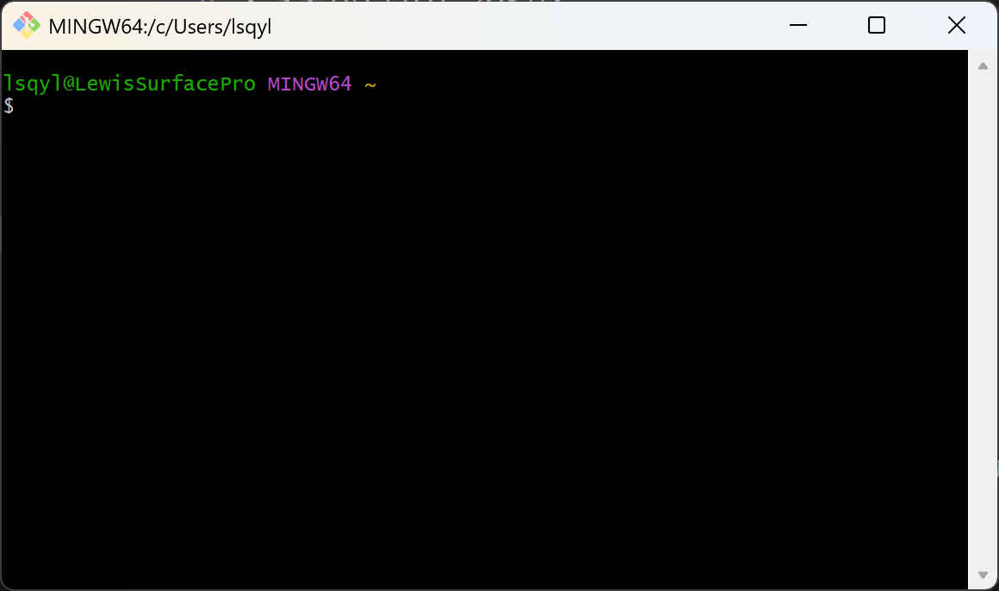

### Git CMD

`Git CMD`和cmd相差无几

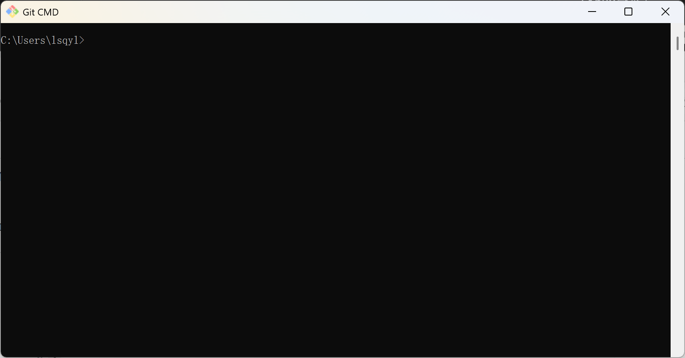

### Git FAQs

`Git FAQs` 就是 Git Frequently Asked Questions（常问问题）
[访问地址](https://github.com/git-for-windows/git/wiki/FAQ)

### Git GUI

`Git GUI`就是Git的图形化工具，如果想用图形化的工具的化，一般不会去用自带的，这边我推荐几个Git的图形化工具，感兴趣的可以自己上网搜索，下载

* sourcetree（开源、免费、功能强大、支持Mac、Windows ）
* tortoisegit（免费、中文界面、只支持Windows）
* GitHub Desktop（常使用GitHub）

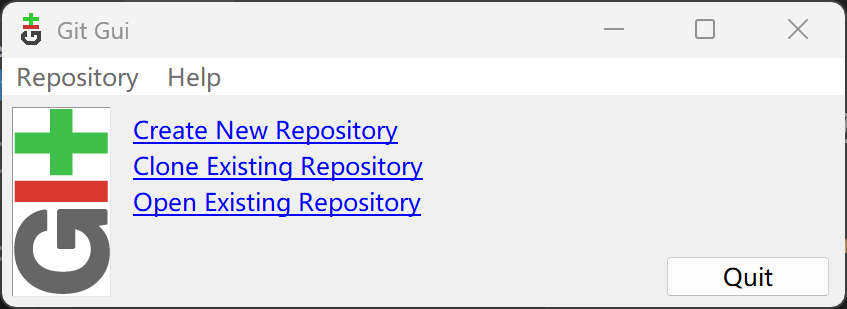

### Git Release Notes

`Git Release Notes`通常用于记录每个版本的新功能、改进、Bug修复以及其他重要的变更信息。

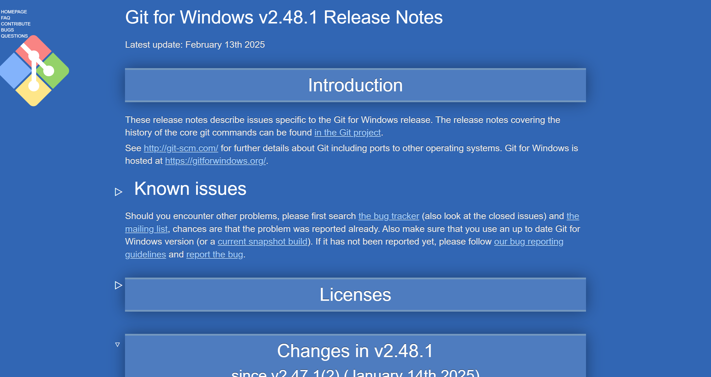